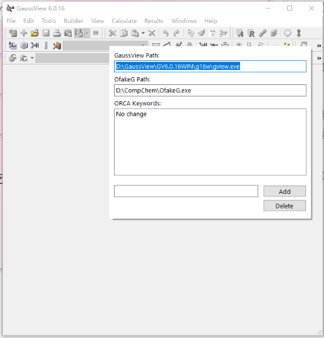
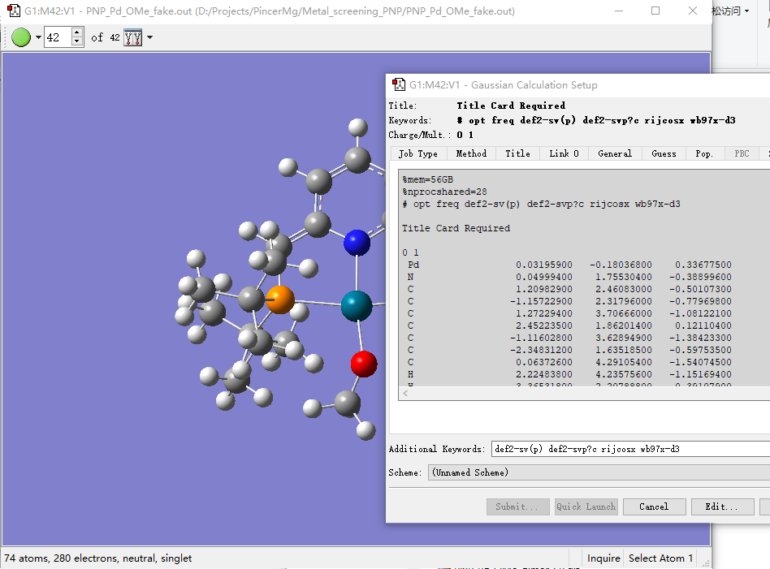
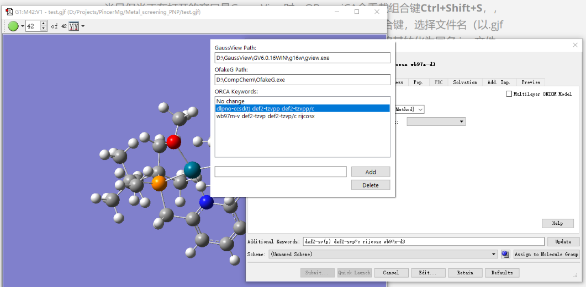
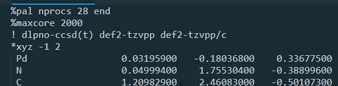

# ORmagiCA: A desktop helper to adapt GaussView with ORCA  
# ORmagiCA: 让GaussView和ORCA完美集成的桌面助手  

## Language / 语言目录
- [English](#english)
- [中文](#中文)

---

## English

### Introduction
Due to its free and efficient nature, along with support for many advanced methods, ORCA has increasingly become an indispensable tool in quantum chemistry research. Although ORCA’s input and output file structure is not complicated, the lack of a killer graphical tool makes the workflow tiring. Users often need to switch between different software and repeatedly copy various pieces of text manually. Sobereva developed OfakeG ([OfakeG: A tool to make GaussView visualize ORCA output files - 思想家公社的门口：量子化学·分子模拟·二次元](http://sobereva.com/498)), which converts ORCA output files into Gaussian `.log` format so that GaussView can read them. However, the manual steps of running OfakeG and then opening the generated `.log` in GaussView are still cumbersome. Additionally, converting a model built in GaussView into an ORCA input file still requires manual coordinate copying.  

The role of ORmagiCA is to fully streamline this workflow, allowing the user to handle most ORCA-related operations within GaussView alone, achieving the same smooth experience as when dealing with Gaussian input and output files.

ORmagiCA is a desktop helper based on AutoHotkey 2. After installing AutoHotkey 2, simply double-click the `ORmagiCA.ahk` file to run it in the background. You can also add it to your startup items.

---

### 1. First-time setup
ORmagiCA needs to call the executable files of GaussView and OfakeG. When using it for the first time, you need to set their locations. The program will then generate an `ORmagiCA_settings.ini` file to store the settings and read them automatically afterward.

To set them:  
First open GaussView, then press **Ctrl+Shift+D** to summon the settings dialog. Fill in the corresponding paths. The dialog hides automatically when clicking elsewhere, and can be summoned again using the same shortcut. This shortcut works only when GaussView is active and will not affect other programs.

At the bottom of the dialog, there is also a “Keyword Presets” list, explained in Section (4).

---

### 2. Loading ORCA input/output files
In File Explorer, select an ORCA output file (`.out`) or input file (`.inp`) and press **Ctrl+Shift+G** to wake ORmagiCA.  

- For `.inp` files, it will directly load them into GaussView.  
- For `.out` files, it will call OfakeG to convert the format and then load it.  

During conversion, an intermediate file ending with `_fake.gjf` or `_fake.log` will be generated in the current directory and automatically deleted after GaussView opens it.

ORmagiCA will recognize charge, spin multiplicity, `nprocs`, `memory` (converted to Gaussian’s `%memory`), keywords (starting with `!`), and other `%` options. Since GaussView cannot preview keywords containing a slash (e.g., `def2-SVP/C`), slashes will be replaced by question marks. Options starting with `%` are placed in “Additional Input”.

---

### 3. Saving ORCA input files
Only when GaussView is the active window will ORmagiCA remap **Ctrl+Shift+S** to save the current molecule as an ORCA `.inp` file. After pressing the shortcut and selecting a `.gjf` file name, GaussView saves the `.gjf` file, and ORmagiCA immediately converts it into a same-named `.inp` file, deleting the intermediate `.gjf`.

This conversion is essentially the reverse of the process in Section (2): charge, spin multiplicity, `nprocs`, `maxcore`, and keyword formatting are all handled automatically.

---

### 4. Keyword presets
A key feature of ORmagiCA is the keyword preset function.  

Press **Ctrl+Shift+D** to open the settings dialog. The bottom “ORCA Keywords” list defaults to “No change”. In this mode, when saving an input file, keywords will match those previewed in GaussView (per Section 3 logic).

If you frequently need to convert an `opt freq` final structure into a further job with specific keywords, keyword presets are for you. Add your keywords in the bottom text box, select them in the list, then hide the dialog. From then on, no matter what GaussView previews, the saved `.inp` file will use the preset keywords.

To revert to the default, simply set the selection back to “No change”.

These settings are saved in `ORmagiCA_settings.ini` and do not need to be entered again at startup.

---

### 5. Citation
If ORmagiCA is part of your workflow, please cite this GitHub page:  

Yumiao Ma. KST48: ORmagiCA: A desktop helper to adapt GaussView with ORCA. https://github.com/RimoAccelerator/ORmagiCA, accessed on xxxx.xx.xx.

---

## 中文

### 简介
由于免费、高效的特性且支持大量先进方法，ORCA日渐成为了量子化学研究中不可或缺的工具。尽管ORCA的输入输出文件结构并不复杂，但由于缺乏一款杀手级的图形化工具，使用ORCA的工作流仍然让人疲惫，经常需要在不同软件之间来回切换、不得不反复复制提取各种文本信息。Sobereva开发了OfakeG（[OfakeG：使GaussView能够可视化ORCA输出文件的工具 - 思想家公社的门口：量子化学·分子模拟·二次元](http://sobereva.com/498)），可以将ORCA输出文件转换为Gaussian的`.log`文件格式，从而让GaussView读取；但手动调用OfakeG、用GaussView打开生成的`.log`文件的多步操作仍然繁琐，而且在GaussView里建立好模型后想转化成ORCA输入文件仍然要手动复制坐标。  

ORmagiCA的作用就是彻底打通工作流，让用户能够用GaussView一个软件搞定大部分与ORCA相关的操作，使用户获得如同用GaussView处理Gaussian输入输出文件一样的畅快感受。

ORmagiCA是一个基于Autohotkey 2的桌面助手。在安装Autohotkey 2后，双击`ORmagiCA.ahk`文件即自动在后台运行。我们也可以把它加入到启动项中。

---

### 1. 初次使用的设置
ORmagiCA需要调用GaussView和OfakeG的可执行文件。初次使用时，需要先设置它们的位置；随后，它会生成一个`ORmagiCA_settings.ini`文件记录设置信息，以后就会自动读取。

设置方法为：  
首先打开GaussView，然后按下组合键**Ctrl+Shift+D**，召唤设置对话框。然后将相应路径填写进去即可。当鼠标点击别的地方时，这个对话框自动隐藏，随时可以通过相同方法召唤。这个组合键仅在GaussView激活时生效，不会影响到其他程序。

在路径下方，还有一个“关键字预设”列表，在第（4）部分会介绍。

---

### 2. 载入ORCA输入/输出文件
在资源管理器中选中ORCA输出文件（`.out`）或输入文件（`.inp`），按下组合键**Ctrl+Shift+G**，ORmagiCA就会被唤醒。

- 对于`.inp`文件，它会直接读取并载入到GaussView里；  
- 对于`.out`文件，它会调用OfakeG进行格式转换再载入。  

这些转换过程都会在当前目录首先生成一个以`_fake.gjf`或`_fake.log`结尾的中间文件，等待GaussView打开后自动删除。

无论是`.inp`还是`.out`文件，ORmagiCA都会识别其中的电荷、自旋多重度、`nprocs`并行设置、`memory`内存设置（自动换算成Gaussian的`%memory`）、关键字（以`!`开头）、其他以`%`开头的选项。由于GaussView无法预览带有斜线的关键字，诸如`def2-SVP/C`等中的斜线会被替换成问号。以`%`开头的选项会被统一放在“Additional Input”里。

---

### 3. 保存ORCA输入文件
当且仅当正在打开的窗口是GaussView时，ORmagiCA会重载组合键**Ctrl+Shift+S**，用于将当前分子保存成ORCA输入文件（`.inp`）。按下这一组合键，选择文件名（以`.gjf`结尾）后，GaussView保存`.gjf`文件，ORmagiCA随即介入，将其转化为同名`.inp`文件，并删除中间体`.gjf`文件。这一转化相当于（2）中读取过程的逆过程：电荷、自旋多重度、`nprocs`、`maxcore`、关键字写法等都会自动转换。

---

### 4. 关键字预设
ORmagiCA的一个特色功能是关键字预设。

按下组合键**Ctrl+Shift+D**召唤设置对话框，底部的ORCA关键字列表带有一个默认值“No change”。选择此项，则保存输入文件时遵循（3）中的逻辑，关键字与GaussView内预览的相同。

我们经常需要将`opt freq`的最终构型转化为带有特定关键字的进一步任务，关键字预设就是为了应对这种场合。通过最底部的文本框添加关键字，在列表中选中，然后在别的地方点击一下隐藏掉设置窗口，接下来保存`.inp`文件时，无论GaussView内预览的关键字是什么，保存出来的都会是在设置窗口里选中的关键字。

当然，如果你想切换回默认模式，可以随时将选择项改成“No change”。

这些设置同样会保存在`ORmagiCA_settings.ini`里，不需要每次启动时都输入。

---

### 5. 引用
如果你的工作流中使用了ORmagiCA，欢迎引用本Github页面：  

Yumiao Ma. KST48: ORmagiCA: A desktop helper to adapt GaussView with ORCA. https://github.com/RimoAccelerator/ORmagiCA, accessed on xxxx.xx.xx.
